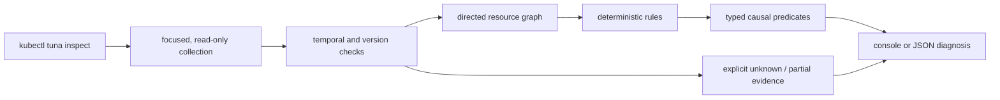

# Tuna

**From disconnected Kubernetes findings to a causal diagnosis.**

> Project status: pre-release, experimental alpha. Tuna is not published to
> Krew and has no supported version yet. The current priority is diagnostic
> precision and failure honesty, not distribution.

The executable is `kubectl-tuna`, invoked by operators as `kubectl tuna`.
Tuna deliberately does not install a bare `tuna` command.

Kubernetes failures usually surface as several observations: a Service has no
ready endpoints, a Pod is NotReady, and a readiness probe is failing. Tuna
builds a small relationship graph around the resource being inspected,
evaluates deterministic rules, and links findings only when a specific
Kubernetes relationship supports the causal step.

**Local by design:** at runtime Tuna requires no LLM, API key, SaaS backend,
telemetry endpoint, update service, or third-party outbound connection. It only
communicates with the Kubernetes API configured by the operator.


```console
$ kubectl tuna inspect service payment -n tuna-demo

Kind:      Service
Namespace: tuna-demo
Name:      payment
Kubernetes: v1.36.2
Health:    DEGRADED

Root cause candidates

  [1] CRITICAL readiness-probe-port-mismatch  (confidence: high, impact: current)
      Pod/payment-7b889d-x8p2 (tuna-demo)
      container/app
      Readiness probe of container "app" targets port 8080, but the container declares 80 (name: http)

    Causal chain:
      readiness-probe-port-mismatch
        → readiness-probe-failing
          → pod-not-ready
            → service-no-ready-endpoints
```

This is a reproducible Kind scenario in `examples/broken-readiness-port`: a
four-step traffic failure chain plus the related Deployment availability
symptom, presented as one diagnosis. The Pod name and event count vary between
runs.

## Run from source

There is intentionally no release or Krew installation instruction yet.

```bash
go test ./...
go build -o ./bin/kubectl-tuna ./cmd/kubectl-tuna
./bin/kubectl-tuna inspect service payment -n finance
```

For local testing as a kubectl PATH plugin:

```bash
make install-plugin
kubectl tuna inspect service payment -n finance
```

`make install-plugin` only installs a locally built binary. It does not publish
anything.

## Network and data boundary

Once the binary is available, Tuna runs without calling an external service.
At runtime it sends read-only requests only to the Kubernetes API selected by
the operator's kubeconfig. It does not send cluster evidence to an LLM, SaaS
backend, telemetry collector, update server, or other third-party endpoint.
In an air-gapped or restricted network, Tuna itself therefore requires no
Internet connection at runtime when the cluster API and required authentication
services are reachable inside that boundary.

This is deliberately a runtime claim, not a promise that every surrounding
workflow is offline. The Kubernetes API must still be reachable and the
credentials must be valid. Cloud or SSO credential plugins may contact their
own provider endpoints to obtain or refresh a token. Building Tuna from source
may also need network access to download Go modules until reproducible prebuilt
release artifacts exist.

## Usage

```bash
# Traffic path: Service → selected Pods and EndpointSlices
kubectl tuna inspect service NAME -n NAMESPACE

# Workload lifecycle: Deployment → ReplicaSets → Pods
kubectl tuna inspect deployment NAME -n NAMESPACE

# Pod, owner chain, scheduled Node, and selecting Services
kubectl tuna inspect pod NAME -n NAMESPACE

# Machine-readable output
kubectl tuna inspect service NAME -n NAMESPACE -o json
```

| Exit code | Meaning |
|---|---|
| `0` | No confirmed current problem on the inspected resource. Risk, historical, or non-blocking partial-evidence notes may still be present. |
| `2` | A confirmed current problem exists on the inspected resource. |
| `1` | The command failed, or required evidence was unavailable and health is `unknown`. |

## How it works

Tuna uses the current kubeconfig to collect a focused graph around one Service,
Deployment, or Pod. It verifies that the focus did not change during
collection, evaluates deterministic rules against structured Kubernetes state,
and connects findings only when an explicit typed relationship supports the
causal step.



The trust boundary is intentionally conservative: API errors are not treated
as absence, rules fail closed outside their reviewed Kubernetes range, Secret
payloads are never fetched, and graph proximity alone cannot create causality.
See [How Tuna works](docs/how-it-works.md) for the full collection, graph,
rule, correlation, health, and rendering walkthrough.

## Diagnostic coverage

| Family | Findings |
|---|---|
| Traffic path | `service-selector-no-pods`, `service-target-port-mismatch`, `service-no-ready-endpoints`, `service-terminating-endpoints-only`, `readiness-probe-port-mismatch`, `readiness-probe-failing`, `pod-not-ready` |
| Workload lifecycle | `crashloop-backoff`, `image-pull-failure`, `missing-config-reference`, `container-oomkilled`, `container-sigkill`, `deployment-unavailable` |
| Scheduling | `pod-unschedulable` (resource shortage, untolerated taint, affinity/selector mismatch) |
| Node and eviction | `node-pressure`, `pod-evicted` |
| Rollout | `rollout-stuck` |

## Extending diagnostics

Community-authored diagnostics are part of the plan, but arbitrary external
rules are not loaded today. The safe order is: validate in-tree rule metadata
and version behavior, stabilize the normalized evidence/JSON contract, pilot a
bounded declarative rule format, and only then consider a more powerful
out-of-process protocol.

Native Go shared-object plugins are explicitly not the plan: they are tightly
coupled to platform, compiler, and dependency versions and would execute inside
Tuna with the user's cluster credentials. The current contribution contract,
future rule-pack boundaries, causal restrictions, and version model are in
[`docs/extending-rules.md`](docs/extending-rules.md).

The project previously contained a `pdb-blocks-rollout` rule. It was removed:
Deployment and StatefulSet rolling upgrades are not limited by
PodDisruptionBudgets; Kubernetes documents PDB enforcement for voluntary
disruptions through the
[Eviction API](https://kubernetes.io/docs/concepts/workloads/pods/disruptions/).
Keeping that rule would have produced a confident but false causal diagnosis.

For the same reason, Tuna reports `service-selector-no-pods` instead of
claiming a selector mismatch from a merely similar Deployment. Zero selected
Pods is observable; which workload the operator intended is not. The report
therefore presents a wrong selector, an absent workload, and a scaled-to-zero
workload as hypotheses to check rather than pretending one is proven.

## Reproducible scenarios

The examples are intentionally broken systems for a disposable cluster:

```bash
kind create cluster
make demo SCENARIO=broken-readiness-port
make demo SCENARIO=service-selector-mismatch
make demo SCENARIO=oomkilled
make demo SCENARIO=failed-scheduling
```

The four broken scenarios run against Kind in `examples/e2e.sh`, together with
a strict healthy control, a broken-to-recovered readiness flow, a healthy
Service inspected through an identity that is deliberately denied EndpointSlice
access, and two Deployments deliberately selected by the same Service. The RBAC
case must return `unknown` with explicit partial evidence and no false
zero-endpoint finding. The shared-Service case proves that a broken Pod explains
only its owning Deployment even when another selected workload has its own
unavailable finding. A multi-container case keeps a recovered sidecar OOM
historical and separate from another container's active CrashLoop. Additional
fixture and adversarial tests cover healthy state, missing ConfigMaps, ambiguous
SIGKILL signals, eviction, EndpointSlice semantics, API failures, and
deterministic JSON output. CI runs the same suite with digest-pinned Kind images
for Kubernetes 1.34.8, 1.35.5, and 1.36.1. The provisional support gate remains
open for corpus precision, environment diversity, and external-operator
validation.

`make corpus` runs the machine-readable seed-corpus contract. Its current eight
snapshots are author-constructed fake-client fixtures, not real-cluster
evidence; one is a healthy control. Evidence classes, case-acceptance rules,
and the intentionally still-open 25-case/10-control target are documented in
[`docs/corpus.md`](docs/corpus.md).

Each Kubernetes-minor e2e job also retains a 30-day machine-readable evidence
artifact containing its exact API server build, kubelet versions, container
runtimes, distribution label, and Tuna JSON results. Assertions remain in the
executable e2e contract. These are project-authored live reproductions, not
field-validation cases.

## Current limitations

- Only Service, Deployment, and Pod are valid inspection entry points.
- Built-in rules currently have a reviewed Kubernetes 1.34–1.36 window. This
  is not a support guarantee until the multi-version real-cluster gate passes;
  other minors cause version-scoped rules to be skipped.
- Third-party rule packs are not loaded yet. New rules currently require an
  in-tree contribution and the same review/tests as built-ins.
- Some Kubernetes discovery operations are namespace-scoped. The retained
  graph is focused, but the API request set is not yet the minimum possible
  RBAC contract.
- Events are transient and message formats vary. Missing events reduce
  evidence; they must not be read as proof that something never happened.
- Focus-resource revision checks detect a proven transition during collection,
  but they do not make the related multi-resource graph an atomic snapshot.
  Related-resource temporal validation remains open.
- Secret existence is shown as incomplete evidence because Secret data is not
  fetched. The default RBAC contract intentionally keeps it unknown: even a
  metadata-only request would require `get` permission that can fetch the full
  payload outside Tuna.
- Equivalent replica findings are grouped only in console presentation; JSON
  deliberately retains every per-Pod finding and evidence item.
- “Root cause candidate” means the most upstream finding supported by the
  collected graph. It is not a claim that Tuna can see application internals,
  external dependencies, metrics, or logs.
- The JSON schema is not stable while the project remains pre-release.

## What Tuna is not

- It is not an observability platform and does not replace metrics, logs, or
  traces.
- It is not a manifest best-practice linter.
- It is not an AI finding generator.
- It does not modify cluster state.

## Position in the ecosystem

Tuna operates near tools such as
[K8sGPT](https://github.com/k8sgpt-ai/k8sgpt),
[Popeye](https://github.com/derailed/popeye) and
[HolmesGPT](https://github.com/HolmesGPT/holmesgpt).
The differentiation is a product hypothesis, not a proven moat: a small local
binary that produces deterministic, evidence-visible, cross-resource causal
chains and explicitly represents unknown evidence. Real-cluster precision and
operator trust must prove that hypothesis.

## Roadmap

[ROADMAP.md](ROADMAP.md) is organized by evidence gates rather than promised
versions. In order: finish the reliability baseline, validate on adversarial
and real-cluster cases, stabilize the machine-readable evidence contract,
pilot constrained external rule authoring, then consider more resource
families and distribution. Krew submission and a tagged version are
deliberately gated until the existing diagnoses are trustworthy.

## Security

Do not report suspected vulnerabilities or sensitive cluster evidence in a
public issue. Use the private reporting instructions in
[`SECURITY.md`](SECURITY.md). Tuna is experimental, pre-release software and
has no supported versions yet.

## License

Apache-2.0
