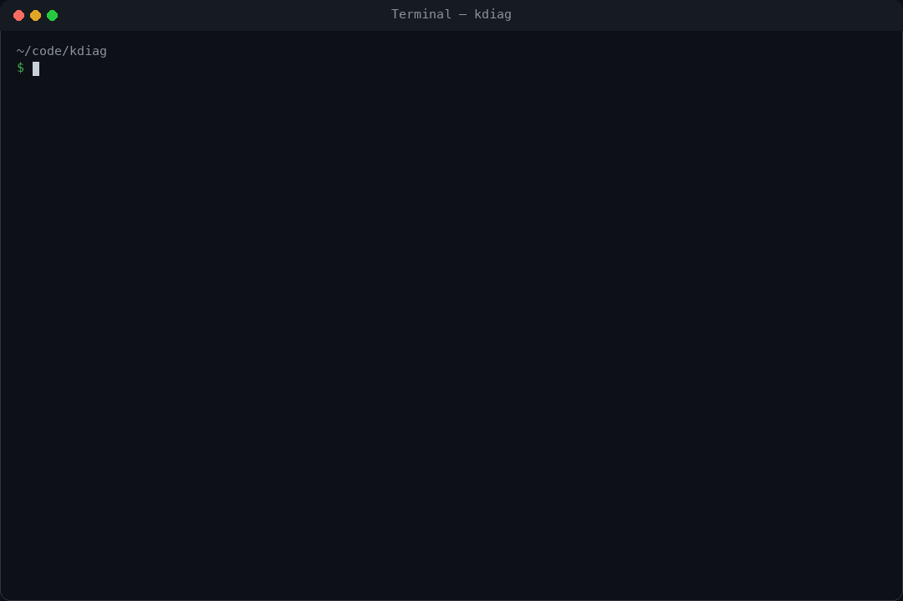
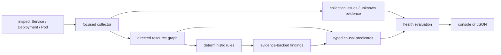

# kdiag

**From disconnected Kubernetes findings to a causal diagnosis.**

> Project status: pre-release, experimental alpha. kdiag is not published to
> Krew and has no supported version yet. The current priority is diagnostic
> precision and failure honesty, not distribution.

Kubernetes failures usually surface as several observations: a Service has no
ready endpoints, a Pod is NotReady, and a readiness probe is failing. kdiag
builds a small relationship graph around the resource being inspected,
evaluates deterministic rules, and links findings only when a specific
Kubernetes relationship supports the causal step.



```console
$ kubectl diag inspect service payment -n kdiag-demo

Kind:      Service
Namespace: kdiag-demo
Name:      payment
Kubernetes: v1.36.2
Health:    DEGRADED

Root cause candidates

  [1] CRITICAL readiness-probe-port-mismatch  (confidence: high, impact: current)
      Pod/payment-8db677cdd-d8fqm (kdiag-demo)
      container/app
      Readiness probe of container "app" targets port 8080, but the container declares 80 (name: http)

    Causal chain:
      readiness-probe-port-mismatch
        → readiness-probe-failing
          → pod-not-ready
            → service-no-ready-endpoints
```

This is a reproducible Kind scenario in `examples/broken-readiness-port`: a
four-step traffic failure chain plus the related Deployment availability
symptom, presented as one diagnosis. The Pod name and event count vary between
runs.

## Run from source

There is intentionally no release or Krew installation instruction yet.

```bash
go test ./...
go build -o ./bin/kdiag ./cmd/kdiag
./bin/kdiag inspect service payment -n finance
```

For local testing as a kubectl PATH plugin:

```bash
make install-plugin
kubectl diag inspect service payment -n finance
```

`make install-plugin` only installs a locally built binary. It does not publish
anything.

## Usage

```bash
# Traffic path: Service → selected Pods and EndpointSlices
kdiag inspect service NAME -n NAMESPACE

# Workload lifecycle: Deployment → ReplicaSets → Pods
kdiag inspect deployment NAME -n NAMESPACE

# Pod, owner chain, scheduled Node, and selecting Services
kdiag inspect pod NAME -n NAMESPACE

# Machine-readable output
kdiag inspect service NAME -n NAMESPACE -o json
```

| Exit code | Meaning |
|---|---|
| `0` | No confirmed current problem on the inspected resource. Risk, historical, or non-blocking partial-evidence notes may still be present. |
| `2` | A confirmed current problem exists on the inspected resource. |
| `1` | The command failed, or required evidence was unavailable and health is `unknown`. |

## How it works

At a high level, kdiag is a pipeline. The collector supplies facts; rules turn
facts into findings; the correlator connects only findings for which a known
Kubernetes mechanism and the required resource relationship both exist.



### 1. Start from one focus resource

The command always has a focus: the Service, Deployment, or Pod named by the
user. Collection expands only far enough to evaluate relationships relevant to
that focus.

| Focus | Relationships collected |
|---|---|
| Service | selected Pods, their owner chains and Nodes, the Service's EndpointSlices, ConfigMap/Secret references, related events |
| Deployment | owned ReplicaSets and Pods, Services selecting those Pods, their EndpointSlices, Nodes, configuration references, related events |
| Pod | owner chain, scheduled Node, Services selecting the Pod, their EndpointSlices, configuration references, related events |

“Focused” describes the retained graph, not a promise that every Kubernetes
API call is object-scoped. Discovering reverse relationships such as “which
Services select this Pod?” still requires some namespace-scoped list calls.
Those calls and the intended minimum RBAC contract are still being tightened.

The collector does not run `exec`, read logs or metrics, or modify cluster
state. It also does not GET Secret objects: Kubernetes' typed Secret GET returns
the payload, which is unnecessary for the current diagnostic model. The exact
current API operations and least-privilege examples are documented in
[`docs/rbac.md`](docs/rbac.md).

### 2. Establish the Kubernetes semantics

The collector asks the API server for its version and records the reported
`GitVersion` in both console and JSON output. Every registered rule declares an
inclusive Kubernetes minor-version range whose semantics have been reviewed.
The engine evaluates the rule only when the server version is inside that
range. Outside it, the rule is listed under `rules.skipped`, the missing
coverage is visible, and an otherwise healthy result becomes `unknown`.

The current built-in range is Kubernetes 1.34–1.36, the three maintained minor
branches at the time of this pre-release work. This is not yet a support claim:
the full range still needs real-cluster e2e validation. A new Kubernetes minor
does not become compatible merely because the API request still succeeds. The
window is reviewed and advanced deliberately. See the Kubernetes
[release list](https://kubernetes.io/releases/) and
[version skew policy](https://kubernetes.io/releases/version-skew-policy/).

Server minor version is also not the whole environment. Feature gates,
available APIs, distribution behavior, and kubelet versions can differ. Rules
that eventually depend on those facts will need explicit capability or
component-version requirements; they cannot infer them from the server version
alone.

### 3. Build a directed, typed graph

Every retained object becomes a graph node identified by kind, namespace, and
name. Relationships are directed edges with a specific meaning:

```text
Service    --selects------> Pod
Service    --routes-to----> EndpointSlice
Deployment --owns---------> ReplicaSet --owns---------> Pod
Pod        --references---> ConfigMap / Secret reference
Pod        --scheduled-on-> Node
```

Direction and edge type are part of correctness. Two Pods being reachable
through the same Service does not make them causally interchangeable. Likewise,
a Node can explain an eviction only when the affected Pod has a
`scheduled-on` edge to that exact Node.

A referenced object can be in one of three states:

- **present:** the API returned the object;
- **missing:** a definitive `NotFound` response was received;
- **unknown:** the lookup failed, lacked permission, or was intentionally not
  performed.

Rules may diagnose `missing`; they must never silently convert `unknown` into
`missing`.

### 4. Evaluate independent diagnostic rules

Rules inspect structured Kubernetes state and emit findings. A finding is not
just a message; it carries a machine-readable type, resource, optional
container subject, evidence, recommendations, and three separate
classifications:

| Field | Question it answers | Examples |
|---|---|---|
| Severity | How serious would this condition be? | `critical`, `warning`, `info` |
| Confidence | How strongly does the collected evidence support this conclusion? | `high`, `medium`, `low` |
| Impact | Is it active now, a risk, or historical? | `current`, `risk`, `historical` |

These fields are intentionally independent. For example, a previous OOM kill
can be critical evidence with high confidence but historical impact after the
Pod has recovered. Conversely, an undeclared numeric port is a current
configuration risk but not proof that the process is not listening there.

Structured fields are the primary trigger. Event messages are used narrowly:
for example, a numeric readiness-probe mismatch is upgraded only when a
readiness event reports a connection refusal on that same port. An unrelated
`Unhealthy` event is insufficient.

Built-in rules live in a validated registry. The registry requires a unique
rule ID, family, description, owned finding types, and Kubernetes compatibility
range. Two rules cannot claim the same finding type, and an undeclared emitted
type is discarded as an engine error instead of entering a causal chain. The
engine records the originating rule ID on every accepted finding. This is the
internal foundation for future community rule packs, not yet a stable public
plugin API.

### 5. Correlate findings with mechanism-specific predicates

After all rules run, kdiag evaluates an explicit list of allowed causal steps.
Each step requires both finding types and an exact relationship predicate.

```text
readiness-probe-port-mismatch
  -- same Pod + same container --> readiness-probe-failing

pod-not-ready
  -- Service selects that Pod --> service-no-ready-endpoints

pod-not-ready
  -- Deployment owns that Pod through a ReplicaSet --> deployment-unavailable

node-pressure
  -- that Pod is scheduled on that Node --> pod-evicted
```

There is no generic “these objects are within four graph hops, therefore one
caused the other” fallback. If the exact predicate cannot be proven, both
findings remain unlinked. A root cause candidate is therefore the most upstream
finding in the established chain, not an assertion that kdiag can see beyond
its evidence boundary.

### 6. Calculate focus health separately from findings

Health describes the resource the user asked about, not every related object
that happened to enter the graph:

```text
degraded = at least one current finding is on the focus resource
unknown  = no confirmed focus problem, but health-critical evidence is missing
healthy  = neither condition above is true
partial  = one or more evidence sources were unavailable (orthogonal to health)
```

This distinction prevents a healthy Service from being declared degraded only
because one related Pod has a historical finding, while still showing that
finding for context. It also means a Service whose EndpointSlices cannot be
listed becomes `unknown`, not “zero ready endpoints.” Endpoint condition
handling follows the Kubernetes
[EndpointSlice conditions](https://kubernetes.io/docs/concepts/services-networking/endpoint-slices/#conditions):
serving-but-terminating endpoints are reported as a risk because proxies may
still route to them when every available endpoint is terminating.

### 7. Render the evidence and exit predictably

The console groups root candidates, causal chains, propagated symptoms, other
findings, skipped rules, and incomplete evidence. JSON flattens causal links to
finding IDs so consumers do not need to parse console text. Exit status is
based on focus health: `0` for healthy, `2` for degraded, and `1` for unknown
or command/API failure.

The implementation is split along the same boundaries:

- collection: [`internal/kube/collector.go`](internal/kube/collector.go)
- graph model: [`internal/graph/graph.go`](internal/graph/graph.go)
- rules and engine: [`internal/diag`](internal/diag)
- causal predicates: [`internal/diag/correlate.go`](internal/diag/correlate.go)
- reporters: [`internal/report`](internal/report)

### Example: broken readiness port

For the demo above, the pipeline does the following:

1. Fetches `Service/payment` and discovers the Pod selected by `app=payment`.
2. Reads the Pod's readiness probe (`8080`) and declared container port (`80`).
3. Reads EndpointSlices and observes that the Service has no ready endpoint.
4. Uses the matching connection-refused readiness event as supporting evidence
   for port `8080`.
5. Emits independent probe, Pod readiness, Service endpoint, and Deployment
   availability findings.
6. Links only the same-container probe findings, then follows the exact
   Service→Pod and Deployment→ReplicaSet→Pod relationships.
7. Reports the invalid probe port as the upstream candidate and the readiness,
   endpoint, and availability findings as propagated symptoms.

The trust model is deliberately conservative:

1. **Structured state first.** Conditions, statuses, fields, and object
   relationships trigger findings. Event text is supporting evidence or a
   narrow confidence upgrade.
2. **Absence is not an API error.** Failed evidence collection is emitted as
   incomplete evidence. Rules that need that source do not infer “missing” or
   “zero” from the failure.
3. **Causality is directional.** A shared Service cannot bridge a problem from
   one workload to another, and an OOM in one container cannot explain a
   CrashLoop in another container.
4. **Impact is separate from severity.** A high-severity historical OOM or a
   medium-confidence risk can be reported without declaring a currently Ready
   resource degraded.
5. **Secret payloads are not diagnostic input.** kdiag currently leaves Secret
   existence as unknown rather than issuing a typed GET that returns its data.

## Diagnostic coverage

| Family | Findings |
|---|---|
| Traffic path | `service-selector-no-pods`, `service-target-port-mismatch`, `service-no-ready-endpoints`, `service-terminating-endpoints-only`, `readiness-probe-port-mismatch`, `readiness-probe-failing`, `pod-not-ready` |
| Workload lifecycle | `crashloop-backoff`, `image-pull-failure`, `missing-config-reference`, `container-oomkilled`, `container-sigkill`, `deployment-unavailable` |
| Scheduling | `pod-unschedulable` (resource shortage, untolerated taint, affinity/selector mismatch) |
| Node and eviction | `node-pressure`, `pod-evicted` |
| Rollout | `rollout-stuck` |

## Extending diagnostics

Community-authored diagnostics are part of the plan, but arbitrary external
rules are not loaded today. The safe order is: validate in-tree rule metadata
and version behavior, stabilize the normalized evidence/JSON contract, pilot a
bounded declarative rule format, and only then consider a more powerful
out-of-process protocol.

Native Go shared-object plugins are explicitly not the plan: they are tightly
coupled to platform, compiler, and dependency versions and would execute inside
kdiag with the user's cluster credentials. The current contribution contract,
future rule-pack boundaries, causal restrictions, and version model are in
[`docs/extending-rules.md`](docs/extending-rules.md).

The project previously contained a `pdb-blocks-rollout` rule. It was removed:
Deployment and StatefulSet rolling upgrades are not limited by
PodDisruptionBudgets; Kubernetes documents PDB enforcement for voluntary
disruptions through the
[Eviction API](https://kubernetes.io/docs/concepts/workloads/pods/disruptions/).
Keeping that rule would have produced a confident but false causal diagnosis.

For the same reason, kdiag reports `service-selector-no-pods` instead of
claiming a selector mismatch from a merely similar Deployment. Zero selected
Pods is observable; which workload the operator intended is not. The report
therefore presents a wrong selector, an absent workload, and a scaled-to-zero
workload as hypotheses to check rather than pretending one is proven.

## Reproducible scenarios

The examples are intentionally broken systems for a disposable cluster:

```bash
kind create cluster
make demo SCENARIO=broken-readiness-port
make demo SCENARIO=service-selector-mismatch
make demo SCENARIO=oomkilled
make demo SCENARIO=failed-scheduling
```

The four broken scenarios run against Kind in `examples/e2e.sh`, together with
a strict healthy control and a broken-to-recovered readiness flow. Additional
fixture and adversarial tests cover healthy state, missing ConfigMaps,
ambiguous SIGKILL signals, eviction, EndpointSlice semantics, API failures,
cross-workload correlation, cross-container correlation, and deterministic
JSON output. CI is configured to run the same suite with digest-pinned Kind
images for Kubernetes 1.34.8, 1.35.5, and 1.36.1; the provisional support gate
remains open until those runs are observed and kept green.

## Current limitations

- Only Service, Deployment, and Pod are valid inspection entry points.
- Built-in rules currently have a reviewed Kubernetes 1.34–1.36 window. This
  is not a support guarantee until the multi-version real-cluster gate passes;
  other minors cause version-scoped rules to be skipped.
- Third-party rule packs are not loaded yet. New rules currently require an
  in-tree contribution and the same review/tests as built-ins.
- Some Kubernetes discovery operations are namespace-scoped. The retained
  graph is focused, but the API request set is not yet the minimum possible
  RBAC contract.
- Events are transient and message formats vary. Missing events reduce
  evidence; they must not be read as proof that something never happened.
- Secret existence is shown as incomplete evidence because Secret data is not
  fetched. The default RBAC contract intentionally keeps it unknown: even a
  metadata-only request would require `get` permission that can fetch the full
  payload outside kdiag.
- Similar failures across several replicas are reported per Pod; report-level
  grouping is not implemented yet.
- “Root cause candidate” means the most upstream finding supported by the
  collected graph. It is not a claim that kdiag can see application internals,
  external dependencies, metrics, or logs.
- The JSON schema is not stable while the project remains pre-release.

## What kdiag is not

- It is not an observability platform and does not replace metrics, logs, or
  traces.
- It is not a manifest best-practice linter.
- It is not an AI finding generator.
- It does not modify cluster state.

## Position in the ecosystem

kdiag operates near tools such as
[K8sGPT](https://github.com/k8sgpt-ai/k8sgpt),
[Popeye](https://github.com/derailed/popeye),
[HolmesGPT](https://github.com/HolmesGPT/holmesgpt), and graph-oriented projects
such as [kubernetes-ontology](https://github.com/avitaltamir/kubernetes-ontology).
The differentiation is a product hypothesis, not a proven moat: a small local
binary that produces deterministic, evidence-visible, cross-resource causal
chains and explicitly represents unknown evidence. Real-cluster precision and
operator trust must prove that hypothesis.

## Roadmap

[ROADMAP.md](ROADMAP.md) is organized by evidence gates rather than promised
versions. In order: finish the reliability baseline, validate on adversarial
and real-cluster cases, stabilize the machine-readable evidence contract,
pilot constrained external rule authoring, then consider more resource
families and distribution. Krew submission and a tagged version are
deliberately gated until the existing diagnoses are trustworthy.

## License

Apache-2.0
