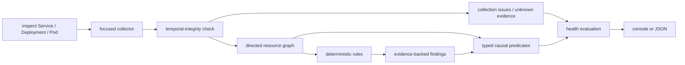

# How Tuna works

At a high level, Tuna is a pipeline. The collector supplies facts; rules turn
facts into findings; the correlator connects only findings for which a known
Kubernetes mechanism and the required resource relationship both exist.



### 1. Start from one focus resource

The command always has a focus: the Service, Deployment, or Pod named by the
user. Collection expands only far enough to evaluate relationships relevant to
that focus.

| Focus | Relationships collected |
|---|---|
| Service | selected Pods, their owner chains and Nodes, the Service's EndpointSlices, ConfigMap/Secret references, related events |
| Deployment | owned ReplicaSets and Pods, Services selecting those Pods, their EndpointSlices, Nodes, configuration references, related events |
| Pod | owner chain, scheduled Node, Services selecting the Pod, their EndpointSlices, configuration references, related events |

“Focused” describes the retained graph, not a promise that every Kubernetes
API call is object-scoped. Discovering reverse relationships such as “which
Services select this Pod?” still requires some namespace-scoped list calls.
Those calls and the intended minimum RBAC contract are still being tightened.

The collector does not run `exec`, read logs or metrics, or modify cluster
state. It also does not GET Secret objects: Kubernetes' typed Secret GET returns
the payload, which is unnecessary for the current diagnostic model. The exact
current API operations and least-privilege examples are documented in
[`docs/rbac.md`](rbac.md).

### 2. Establish temporal integrity

Live collection is a sequence of API calls, not an atomic cluster snapshot.
Tuna records the collection start/end timestamps and the focus resource's
starting and ending `resourceVersion` and `generation` under JSON
`collection`. After gathering related evidence, it reads the focus resource
again. If that final read fails, or the focus identity/revision changed, the
graph is known to span a transition: rule evaluation is suspended and health
is `unknown` rather than presenting a mixed-time causal chain.

For every collected Deployment and ReplicaSet, Tuna also requires
`status.observedGeneration >= metadata.generation`. A related controller that
has not observed the latest specification is reconciling stale status;
diagnosing availability or rollout state from that window would be premature.

This baseline proves focus-resource stability and controller-generation
freshness. It does not claim an atomic snapshot across related Pods, Services,
and EndpointSlices; the bounded policy for those independently changing
resources remains explicit. The alternatives, costs, benchmark, and current
decision are documented in
[`docs/temporal-integrity.md`](temporal-integrity.md).

### 3. Establish the Kubernetes semantics

The collector asks the API server for its version and records the reported
`GitVersion` in both console and JSON output. Every registered rule declares an
inclusive Kubernetes minor-version range whose semantics have been reviewed.
The engine evaluates the rule only when the server version is inside that
range. Outside it, the rule is listed under `rules.skipped`, the missing
coverage is visible, and an otherwise healthy result becomes `unknown`.

The current built-in range is Kubernetes 1.34–1.36, the three maintained minor
branches at the time of this pre-release work. The digest-pinned Kind CI matrix
for these minors has been observed green, but this is not yet a support claim:
the corpus, mixed-component, distribution, and external-operator gates remain
open. A new Kubernetes minor does not become compatible merely because the API
request still succeeds. The window is reviewed and advanced deliberately. See
the Kubernetes
[release list](https://kubernetes.io/releases/) and
[version skew policy](https://kubernetes.io/releases/version-skew-policy/).

Server minor version is also not the whole environment. Feature gates,
available APIs, distribution behavior, and kubelet versions can differ. Rules
that eventually depend on those facts will need explicit capability or
component-version requirements; they cannot infer them from the server version
alone.

### 4. Build a directed, typed graph

Every retained object becomes a graph node identified by kind, namespace, and
name. Relationships are directed edges with a specific meaning:

```text
Service    --selects------> Pod
Service    --routes-to----> EndpointSlice
Deployment --owns---------> ReplicaSet --owns---------> Pod
Pod        --references---> ConfigMap / Secret reference
Pod        --scheduled-on-> Node
```

Direction and edge type are part of correctness. Two Pods being reachable
through the same Service does not make them causally interchangeable. Likewise,
a Node can explain an eviction only when the affected Pod has a
`scheduled-on` edge to that exact Node.

A referenced object can be in one of three states:

- **present:** the API returned the object;
- **missing:** a definitive `NotFound` response was received;
- **unknown:** the lookup failed, lacked permission, or was intentionally not
  performed.

Rules may diagnose `missing`; they must never silently convert `unknown` into
`missing`.

### 5. Evaluate independent diagnostic rules

Rules inspect structured Kubernetes state and emit findings. A finding is not
just a message; it carries a machine-readable type, resource, optional
container subject, evidence, recommendations, and three separate
classifications:

| Field | Question it answers | Examples |
|---|---|---|
| Severity | How serious would this condition be? | `critical`, `warning`, `info` |
| Confidence | How strongly does the collected evidence support this conclusion? | `high`, `medium`, `low` |
| Impact | Is it active now, a risk, or historical? | `current`, `risk`, `historical` |

These fields are intentionally independent. For example, a previous OOM kill
can be critical evidence with high confidence but historical impact after the
Pod has recovered. Conversely, an undeclared numeric port is a current
configuration risk but not proof that the process is not listening there.

Structured fields are the primary trigger. Event messages are used narrowly:
for example, a numeric readiness-probe mismatch is upgraded only when a
readiness event reports a connection refusal on that same port. An unrelated
`Unhealthy` event is insufficient.

Built-in rules live in a validated registry. The registry requires a unique
rule ID, family, description, owned finding types, and Kubernetes compatibility
range. Two rules cannot claim the same finding type, and an undeclared emitted
type is discarded as an engine error instead of entering a causal chain. The
engine records the originating rule ID on every accepted finding. This is the
internal foundation for future community rule packs, not yet a stable public
plugin API.

### 6. Correlate findings with mechanism-specific predicates

After all rules run, Tuna evaluates an explicit list of allowed causal steps.
Each step requires both finding types and an exact relationship predicate.

```text
readiness-probe-port-mismatch
  -- same Pod + same container --> readiness-probe-failing

pod-not-ready
  -- Service selects that Pod --> service-no-ready-endpoints

pod-not-ready
  -- Deployment owns that Pod through a ReplicaSet --> deployment-unavailable

node-pressure
  -- that Pod is scheduled on that Node --> pod-evicted
```

There is no generic “these objects are within four graph hops, therefore one
caused the other” fallback. If the exact predicate cannot be proven, both
findings remain unlinked. A root cause candidate is therefore the most upstream
finding in the established chain, not an assertion that Tuna can see beyond
its evidence boundary.

### 7. Calculate focus health separately from findings

Health describes the resource the user asked about, not every related object
that happened to enter the graph:

```text
degraded = at least one current finding is on the focus resource
unknown  = no confirmed focus problem, but health-critical evidence is missing
healthy  = neither condition above is true
partial  = one or more evidence sources were unavailable (orthogonal to health)
```

This distinction prevents a healthy Service from being declared degraded only
because one related Pod has a historical finding, while still showing that
finding for context. It also means a Service whose EndpointSlices cannot be
listed becomes `unknown`, not “zero ready endpoints.” Endpoint condition
handling follows the Kubernetes
[EndpointSlice conditions](https://kubernetes.io/docs/concepts/services-networking/endpoint-slices/#conditions):
serving-but-terminating endpoints are reported as a risk because proxies may
still route to them when every available endpoint is terminating.

### 8. Render the evidence and exit predictably

The console groups root candidates, causal chains, propagated symptoms, other
findings, skipped rules, and incomplete evidence. Equivalent Pod findings are
collapsed only when an exact Deployment→ReplicaSet→Pod ownership path, the
same container identity, and the same causal shape are present; each affected
Pod remains visible, and full grouped findings retain evidence per Pod. JSON is
never grouped and keeps every finding, evidence item, and causal link by ID.
Exit status is based on focus health: `0` for healthy, `2` for degraded, and
`1` for unknown or command/API failure.

The implementation is split along the same boundaries:

- collection: [`internal/kube/collector.go`](../internal/kube/collector.go)
- graph model: [`internal/graph/graph.go`](../internal/graph/graph.go)
- rules and engine: [`internal/diag`](../internal/diag)
- causal predicates: [`internal/diag/correlate.go`](../internal/diag/correlate.go)
- reporters: [`internal/report`](../internal/report)

### Example: broken readiness port

For the demo above, the pipeline does the following:

1. Fetches `Service/payment` and discovers the Pod selected by `app=payment`.
2. Reads the Pod's readiness probe (`8080`) and declared container port (`80`).
3. Reads EndpointSlices and observes that the Service has no ready endpoint.
4. Uses the matching connection-refused readiness event as supporting evidence
   for port `8080`.
5. Emits independent probe, Pod readiness, Service endpoint, and Deployment
   availability findings.
6. Links only the same-container probe findings, then follows the exact
   Service→Pod and Deployment→ReplicaSet→Pod relationships.
7. Reports the invalid probe port as the upstream candidate and the readiness,
   endpoint, and availability findings as propagated symptoms.

The trust model is deliberately conservative:

1. **Structured state first.** Conditions, statuses, fields, and object
   relationships trigger findings. Event text is supporting evidence or a
   narrow confidence upgrade.
2. **Absence is not an API error.** Failed evidence collection is emitted as
   incomplete evidence. Rules that need that source do not infer “missing” or
   “zero” from the failure.
3. **Causality is directional.** A shared Service cannot bridge a problem from
   one workload to another, and an OOM in one container cannot explain a
   CrashLoop in another container.
4. **Impact is separate from severity.** A high-severity historical OOM or a
   medium-confidence risk can be reported without declaring a currently Ready
   resource degraded.
5. **Secret payloads are not diagnostic input.** Tuna currently leaves Secret
   existence as unknown rather than issuing a typed GET that returns its data.
6. **Transition windows suspend diagnosis.** A changed/unverifiable focus
   revision or stale collected Deployment/ReplicaSet generation produces
   explicit `unknown` health instead of running rules over mixed-time evidence.
